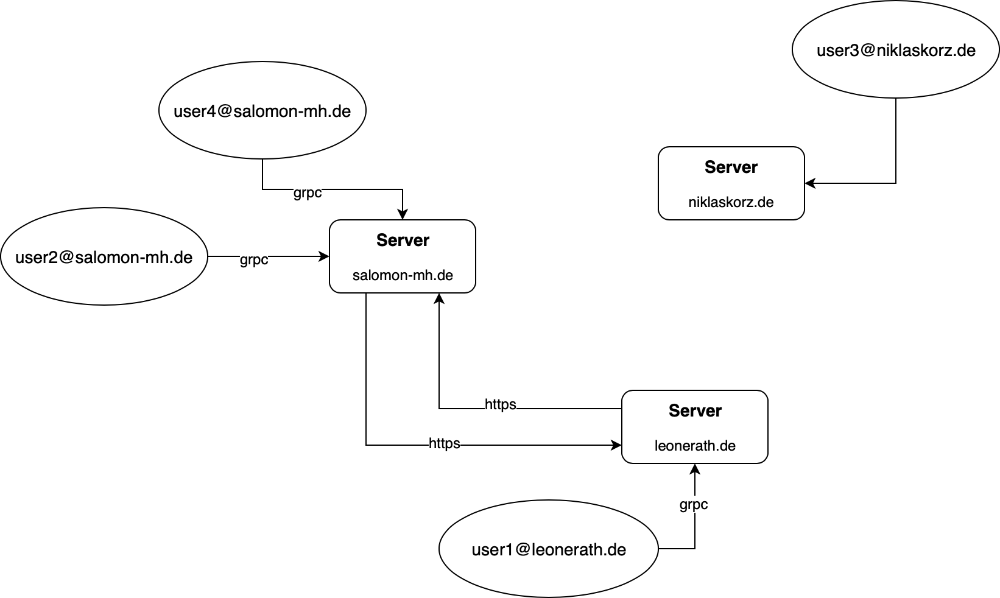

# Leuchtfeuer

Easy to use decentralized chat application featuring end-to-end encryption. 



## Installation

```go
    go get "github.com/AAA-Intelligence/leuchtfeuer"
```

## Getting Started

To compile and run the server, assuming you are in the folder $GOPATH/src/github/AAA-intelligence/leuchtfeuer/, simply:

```go
    go run ./cmd/server/server.go
```

Likewise, to compile and run the client:

```go
    go run ./cmd/client/client.go
```

## Documentation

## Issues

Feel free to submit issues and enhancement requests.

## Contributing

Please refer to each project's style guidelines and guidelines for submitting patches and additions. In general, we follow the "fork-and-pull" Git workflow.

 1. **Fork** the repo on GitHub
 2. **Clone** the project to your own machine
 3. **Commit** changes to your own branch
 4. **Push** your work back up to your fork
 5. Submit a **Pull request** so that we can review your changes

NOTE: Be sure to merge the latest from "upstream" before making a pull request!

## Licensing

[](https://github.com/AAA-Intelligence/leuchtfeuer/LICENSE)

